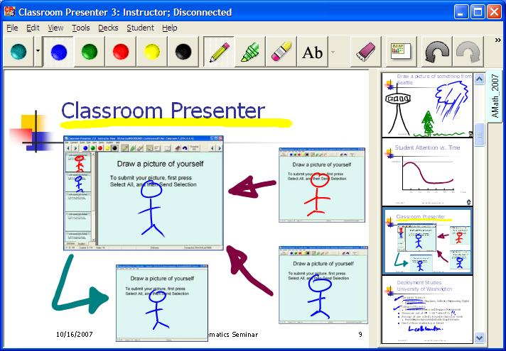

Classroom Presenter
===================

Classroom Presenter is a Tablet PC-based interaction system that supports the sharing of digital ink on slides between instructors and students. When used as a presentation tool, Classroom Presenter allows the integration of digital ink and slides, making it possible to combine the advantages of whiteboard style and slide based presentation. The ability to link the instructor and student devices, and to send information back and forth provides a mechanism for introducing active learning into the classroom and creates additional feedback channels. 

Classroom Presenter is licensed under the Apache License v 2.0.

To build Classroom Presenter we recommend Visual Studio 2010.  

Classroom Presenter Home with binary downloads and documentation: http://classroompresenter.cs.washington.edu

See also related projects:

* [ConferenceXP](http://github.com/conferencexp/conferencexp)
* [CXP Archive Transcoder](http://github.com/fvideon/archivetranscoder)
* [CXP Windows Media Gateway](http://github.com/fvideon/wmgateway)
* [CXP WebViewer](http://github.com/fvideon/webviewer)

